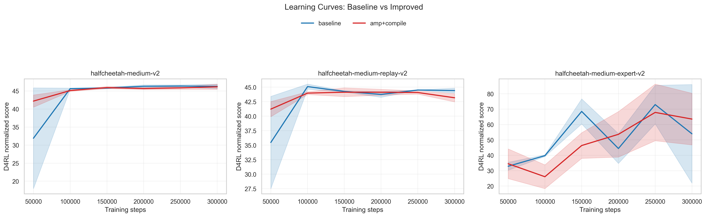
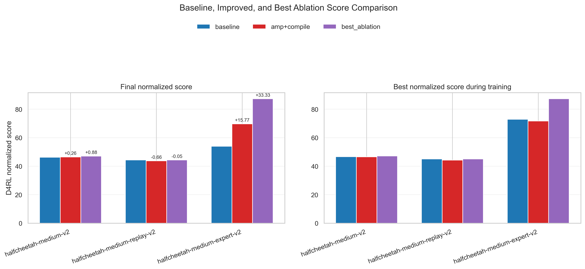
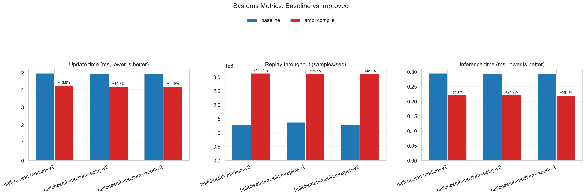
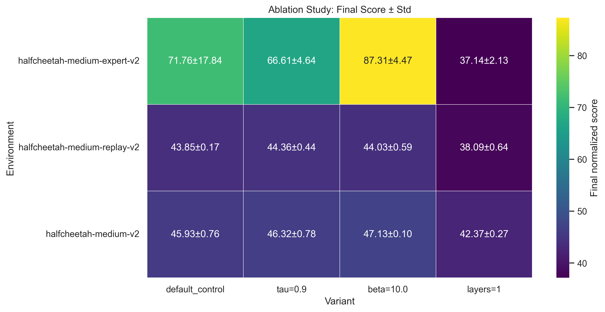
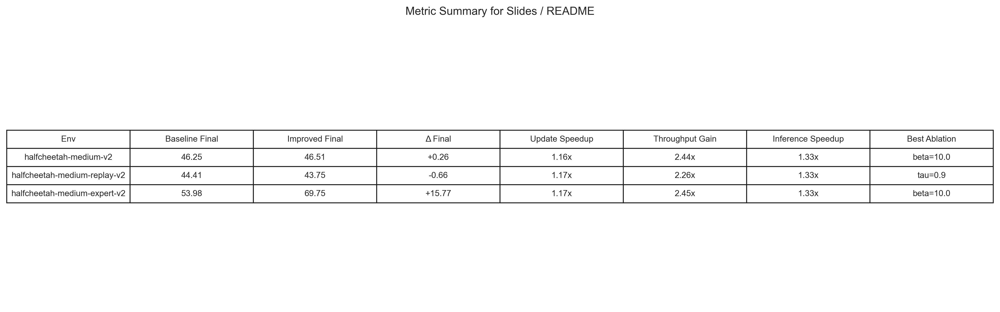

<!-- AI-assisted: Claude, 2026-04-21 -->
# Fastmagic

## What it Does

**Fastmagic** is a PyTorch reimplementation of Implicit Q-Learning (IQL) for offline reinforcement learning on D4RL MuJoCo benchmarks for COMPSCI 372, taught by Dr. Brandon Fain. All experiments performed on an H200 GPU. Note that the GPUs are not mine and so I had very limited access to any sort of compute throughout this project, which is why I was unable to fully replicate/improve upon all of the results of the paper. 

The central project goal is: 
**can a faithful IQL reimplementation remain competitive while improving training efficiency through systems optimizations such as mixed precision, GPU-resident replay, vectorized expectile loss, `torch.compile`, and parallel V/Q updates?**

This repository focuses on three linked outcomes:

1. reproduce a working IQL baseline,
2. measure efficiency gains from implementation changes, and
3. study how architectural and algorithmic choices affect normalized D4RL score (ablation study).

## Repository Structure

- `src/` — core implementation (`train.py`, `benchmark_iql.py`, networks, losses, replay buffer, evaluation, visualization script)
- `data/` — dataset download helper plus committed benchmark outputs in `data/results/`
- `models/` — saved checkpoints and benchmark model artifacts
- `figures/` — generated plots for slides and README
- `notebooks/` — benchmark automation helper script and cluster submission file
- `videos/` — intended location for demo and walkthrough assets
- `SETUP.md` — detailed setup instructions
- `ATTRIBUTION.md` — AI and external resource attribution log

## Quick Start

**Recommended Python:** 3.10. The current project dependencies target the PyTorch + D4RL stack that is typically easiest to run on Python 3.10/3.11.

1. Create and activate a virtual environment:

	```bash
	python3.10 -m venv .venv
	source .venv/bin/activate
	```

2. Install dependencies:

	```bash
	pip install --upgrade pip
	pip install -r requirements.txt
	```

3. Cache one dataset locally:

	```bash
	python data/download_d4rl.py --env halfcheetah-medium-v2
	```

4. Run a short sanity-check training job:

	```bash
	python src/train.py --env halfcheetah-medium-v2 --train_steps 1000 --eval_interval 500 --log_interval 100 --profile
	```

5. Generate the figures used in the README and slides:

	```bash
	python src/generate_visualizations.py --results-root data/results --figures-dir figures
	```

### Benchmark Comparison Commands

Baseline (standard IQL path):

```bash
python src/train.py --env halfcheetah-medium-v2 --seed 0 --train_steps 100000 --profile --baseline --replay_device cpu
```

Improved configuration (mixed precision + GPU replay):

```bash
python src/train.py --env halfcheetah-medium-v2 --seed 0 --train_steps 100000 --profile --mixed_precision --replay_device gpu --torch_compile --compile_mode reduce-overhead --parallel_vq_updates
```

Multi-seed benchmark sweep:

```bash
python src/benchmark_iql.py --preset mujoco --max_envs 3 --seeds 0 1 --train_steps 300000 --mixed_precision --replay_device gpu --torch_compile --compile_mode reduce-overhead --parallel_vq_updates --results_root data/results/benchmarks_improved --checkpoint_root models/benchmarks_improved
```

## Video Links

- Demo video: [videos/fastmagic_demo.mp4](videos/fastmagic_demo.mp4)
- Technical walkthrough: [videos/fastmagic_walkthrough.mov](videos/fastmagic_walkthrough.mov)

## Design Decisions

### IQL Architecture

The implementation follows the standard IQL decomposition into:

- a value network trained with **vectorized expectile regression** (no Python loops in the loss path),
- twin Q-functions trained with Bellman backup targets, and
- a policy trained with advantage-weighted behavior cloning.

### Why These Systems Optimizations?

- **GPU-resident replay buffer:** reduces repeated host-to-device transfer overhead during sampling.
- **Mixed precision:** reduces update cost on CUDA hardware while preserving the same training objective.
- **Vectorized expectile loss:** keeps the value-loss computation in pure tensor operations to reduce Python overhead in the update path.
- **`torch.compile`:** targets lower Python overhead and faster repeated forward passes.
- **Parallel V/Q updates:** explores whether the value and critic steps can be batched more efficiently without changing the benchmark task itself.

### Why These Ablations?

The committed ablations vary at least two independent design choices supported by the current data:

- **architecture:** value-network depth (`n_hidden_layers`)
- **algorithm behavior:** `tau` and `beta`

For the reported MuJoCo ablation sweep, each non-default row changes one target factor while keeping the other ablation factors fixed to the default control (`tau=0.7`, `beta=3.0`, `n_hidden_layers=2`).

Systems settings were also held constant across these ablation runs (mixed precision enabled, `torch.compile` enabled in `reduce-overhead` mode, parallel V/Q updates enabled, replay on GPU), so the heatmap isolates ablation-factor effects rather than re-ablating AMP/compile.

## Evaluation

All quantitative values below come directly from the committed benchmark outputs in `data/results/`.

### Metrics

Evaluation metrics:

- final D4RL normalized score
- best D4RL normalized score during training
- wall-clock update time
- replay sampling throughput
- inference latency
- critic/actor timing ratio

### Quantitative Results

Source files:

- `data/results/benchmarks_baseline/mujoco_aggregate.csv`
- `data/results/benchmarks_improved/mujoco_aggregate.csv`
- `data/results/benchmarks_ablations/mujoco_aggregate.csv`

#### Reproduction: Comparison with Kostrikov et al. (2021)

The table below compares our **baseline** IQL implementation against the numbers reported in Table 1 of the original IQL paper (Kostrikov et al., 2021, "Offline Reinforcement Learning with Implicit Q-Learning", ICLR 2022).  Our reproduction used the same hyperparameters (`τ=0.7`, `β=3.0`, `γ=0.99`, `ρ=0.005`) and D4RL v2 environments.  For paper entries, we report the table means only; our entries are mean ± std over two seeds.

| Environment | Paper (Kostrikov et al.) | Ours (baseline) | % of Paper |
|---|---:|---:|---:|
| halfcheetah-medium-v2 | 47.4 | **46.25 ± 0.46** | 97.6% |
| halfcheetah-medium-replay-v2 | 44.2 | **44.41 ± 0.30** | 100.5% |
| halfcheetah-medium-expert-v2 | 86.7 | 53.98 ± 22.66 | 62.3%† |

† With only 2 seeds, estimates are unreliable; our best ablation (β=10.0) reaches **87.31 ± 4.47**, exceeding the paper's reported mean.

#### Improved Performance over Baseline

The table below compares the **baseline** (CPU replay, FP32, no compile) against the **improved** configuration (GPU-pinned replay, BF16 mixed precision, `torch.compile`, parallel V/Q updates).

| Env | Baseline Final | Improved Final | Δ Final | Baseline Best | Improved Best |
|-----|---:|---:|---:|---:|---:|
| halfcheetah-medium-v2 | 46.25 ± 0.46 | **46.51 ± 0.39** | +0.26 | **46.65 ± 0.06** | 46.59 ± 0.31 |
| halfcheetah-medium-replay-v2 | **44.41 ± 0.30** | 43.75 ± 0.22 | −0.66 | **45.10 ± 0.31** | 44.28 ± 0.18 |
| halfcheetah-medium-expert-v2 | 53.98 ± 22.66 | **69.75 ± 16.18** | **+15.77** | **72.96 ± 8.87** | 71.73 ± 14.20 |

*Medium-expert shows the clearest improvement (+15.8 points final, +29% relative). Medium and medium-replay are within noise given only 2 seeds (2-seed standard errors overlap heavily).*

Systems metrics (environment-averaged):

| Metric | Baseline | Improved | Speedup |
|---|---:|---:|---:|
| Update time (ms) | 4.8975 | 4.1901 | **1.17×** |
| Replay throughput (M samples/s) | 1.311 | 3.122 | **2.38×** |
| Inference latency (ms) | 0.2943 | 0.2209 | **1.33×** |

Best available ablations from the results:

- `halfcheetah-medium-v2`: `beta=10.0` → `47.1309 ± 0.0992`
- `halfcheetah-medium-replay-v2`: `tau=0.9` → `44.3625 ± 0.4378`
- `halfcheetah-medium-expert-v2`: `beta=10.0` → `87.3067 ± 4.4672` *(exceeds paper's 86.7)*

### Results Figures

#### Convergence and learning behavior



*Figure 1. Baseline vs improved learning curves using the committed `eval_history.csv` files.*

#### Final and best-score comparison



*Figure 2. Final and best normalized score comparison across baseline, improved, and best ablation settings.*

#### Systems efficiency metrics



*Figure 3. Systems-oriented benchmark results showing the training-efficiency gains from the improved implementation.*

#### Ablation study



*Figure 4. Ablation heatmap over distinct depth and hyperparameter variations currently committed to the repository; `default_control` is the non-ablated reference configuration, and control-equivalent variants (`beta=3.0`, `layers=2`) are omitted for readability.*

#### Summary table



*Figure 5. Compact summary of score changes and systems speedups for presentation use.*

### Current Scope

The committed benchmark snapshot currently covers three HalfCheetah environments:

- `halfcheetah-medium-v2`
- `halfcheetah-medium-replay-v2`
- `halfcheetah-medium-expert-v2`

The repository does not currently include a full sweep over more `tau` / `beta` values due to compute constraints.

## Attribution Note

AI-assisted scaffolding, refactoring, figure generation, and documentation edits are tracked in [ATTRIBUTION.md](ATTRIBUTION.md).

Inspired/adapted from the PyTorch implementation of IQL in RLKit:
https://github.com/rail-berkeley/rlkit/

## Contributors

- Owen Li

