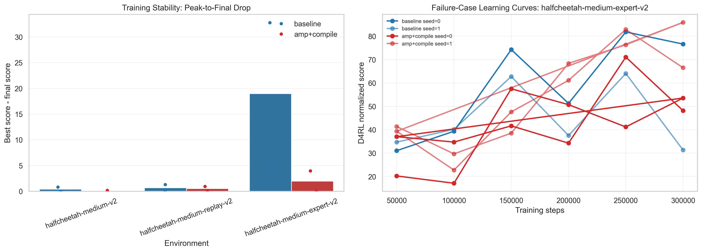

<!-- AI-assisted: Claude, 2026-04-21 -->

## Project Title

# Fastmagic: Speeding Up Implicit Q-Learning (IQL)

## Project Overview

**Fastmagic** is a PyTorch reimplementation of Implicit Q-Learning (IQL) for offline reinforcement learning on D4RL MuJoCo benchmarks for COMPSCI 372, taught by Dr. Brandon Fain. All experiments performed on an H200 GPU. Note that the GPUs are not mine and so I had very limited access to any sort of compute throughout this project, which is why I was unable to fully replicate/improve upon all of the results of the paper. 

The central project goal is: **can a faithful IQL reimplementation remain competitive while improving training efficiency through systems-level optimizations such as mixed precision, GPU-resident replay, `torch.compile`, and streamlined update scheduling?**

This repository focuses on three linked outcomes:

1. reproduce a working IQL baseline,
2. measure efficiency gains from implementation changes, and
3. study how architectural and algorithmic choices affect normalized D4RL score.

## Repository Structure

- `src/` — core implementation (`train.py`, `benchmark_iql.py`, networks, losses, replay buffer, evaluation, visualization script)
- `data/` — dataset download helper plus committed benchmark outputs in `data/results/`
- `models/` — saved checkpoints and benchmark model artifacts
- `figures/` — generated plots for slides and README
- `notebooks/` — benchmark automation helper script and cluster submission file
- `context/` — rubric handout and supporting course materials
- `videos/` — intended location for demo and walkthrough assets
- `SETUP.md` — detailed setup instructions
- `ATTRIBUTION.md` — AI and external resource attribution log

## Quick Start

**Recommended Python:** 3.10. The current project dependencies target the PyTorch + D4RL stack that is typically easiest to run on Python 3.10/3.11.

1. Create and activate a virtual environment:

	```bash
	python3.10 -m venv .venv
	source .venv/bin/activate
	```

2. Install dependencies:

	```bash
	pip install --upgrade pip
	pip install -r requirements.txt
	```

3. Cache one dataset locally:

	```bash
	python data/download_d4rl.py --env halfcheetah-medium-v2
	```

4. Run a short sanity-check training job:

	```bash
	python src/train.py --env halfcheetah-medium-v2 --train_steps 1000 --eval_interval 500 --log_interval 100 --profile
	```

5. Generate the figures used in the README and slides:

	```bash
	python src/generate_visualizations.py --results-root data/results --figures-dir figures
	```

### Benchmark Comparison Commands

Baseline (standard IQL path):

```bash
python src/train.py --env halfcheetah-medium-v2 --seed 0 --train_steps 100000 --profile --baseline --replay_device cpu
```

Improved configuration (mixed precision + GPU replay):

```bash
python src/train.py --env halfcheetah-medium-v2 --seed 0 --train_steps 100000 --profile --mixed_precision --replay_device gpu --torch_compile --compile_mode reduce-overhead --parallel_vq_updates
```

Multi-seed benchmark sweep:

```bash
python src/benchmark_iql.py --preset mujoco --max_envs 3 --seeds 0 1 --train_steps 300000 --mixed_precision --replay_device gpu --torch_compile --compile_mode reduce-overhead --parallel_vq_updates --results_root data/results/benchmarks_improved --checkpoint_root models/benchmarks_improved
```

## Video Links

- Demo video: **add direct course-submission link here before final submission**
- Technical walkthrough: **add direct course-submission link here before final submission**

## Design Decisions

### IQL Architecture

The implementation follows the standard IQL decomposition into:

- a value network trained with expectile regression,
- twin Q-functions trained with Bellman backup targets, and
- a policy trained with advantage-weighted behavior cloning.

### Why These Systems Optimizations?

- **GPU-resident replay buffer:** reduces repeated host-to-device transfer overhead during sampling.
- **Mixed precision:** reduces update cost on CUDA hardware while preserving the same training objective.
- **`torch.compile`:** targets lower Python overhead and faster repeated forward passes.
- **Parallel V/Q updates:** explores whether the value and critic steps can be batched more efficiently without changing the benchmark task itself.

### Why These Ablations?

The committed ablations vary at least two independent design choices supported by the current data:

- **architecture:** value-network depth (`n_hidden_layers`)
- **algorithm behavior:** `tau` and `beta`

This supports a rubric-aligned ablation study without overstating the scope of the completed sweep.

## Evaluation

All quantitative values below come directly from the committed benchmark outputs in `data/results/`.

### Metrics

The evaluation metrics are aligned to the project goal of maintaining or improving offline RL performance while reducing training cost:

- final D4RL normalized score
- best D4RL normalized score during training
- wall-clock update time
- replay sampling throughput
- inference latency
- critic/actor timing ratio

### Quantitative Results

Source files:

- `data/results/benchmarks_baseline/mujoco_aggregate.csv`
- `data/results/benchmarks_improved/mujoco_aggregate.csv`
- `data/results/benchmarks_ablations/mujoco_aggregate.csv`

| Env | Baseline Final (mean ± std) | Improved Final (mean ± std) | Δ Final | Baseline Best (mean ± std) | Improved Best (mean ± std) |
|-----|-------------------------------|-------------------------------|--------:|-----------------------------|-----------------------------|
| halfcheetah-medium-v2 | 46.2466 ± 0.4598 | 46.5077 ± 0.3866 | +0.2611 | 46.6489 ± 0.0574 | 46.5892 ± 0.3052 |
| halfcheetah-medium-replay-v2 | 44.4146 ± 0.3006 | 43.7508 ± 0.2159 | -0.6638 | 45.0968 ± 0.3096 | 44.2828 ± 0.1829 |
| halfcheetah-medium-expert-v2 | 53.9789 ± 22.6584 | 69.7537 ± 16.1791 | +15.7748 | 72.9573 ± 8.8740 | 71.7315 ± 14.2014 |

Environment-averaged systems metrics across the three tasks:

- Update time: `4.8975 ms → 4.1901 ms` (**1.1688x speedup**)
- Replay throughput: `1,310,894 → 3,122,210 samples/s` (**2.3817x**)
- Inference latency: `0.2943 ms → 0.2209 ms` (**1.3327x speedup**)

Best available ablations from the results:

- `halfcheetah-medium-v2`: `beta=10.0` → `47.1309 ± 0.0992`
- `halfcheetah-medium-replay-v2`: `tau=0.9` → `44.3625 ± 0.4378`
- `halfcheetah-medium-expert-v2`: `beta=10.0` → `87.3067 ± 4.4672`

### Results Figures

#### Convergence and learning behavior


*Figure 1. Baseline vs improved learning curves using the committed `eval_history.csv` files. This figure supports the convergence / reward-curve rubric evidence.*

#### Final and best-score comparison


*Figure 2. Final and best normalized score comparison across baseline, improved, and best ablation settings.*

#### Systems efficiency metrics


*Figure 3. Systems-oriented benchmark results showing the training-efficiency gains from the improved implementation.*

#### Ablation study


*Figure 4. Ablation heatmap over the completed depth and hyperparameter variations currently committed to the repository.*

#### Stability and failure-case analysis



*Figure 5. Stability analysis using seed-level raw results and a representative failure-case environment.*

#### Slide-ready summary table


*Figure 6. Compact summary of score changes and systems speedups for presentation use.*

### Rubric Alignment

- **Convergence via learning curves:** supported by Figure 1 and the per-run `eval_history.csv` files.
- **Inference time / throughput reporting:** supported by Figure 3 and the aggregate timing metrics.
- **Ablation study over multiple independent choices:** supported by Figure 4 using depth plus `tau`/`beta` changes.
- **Quantitative comparison of approaches:** supported by Figure 2 and the score table.
- **Error / failure analysis:** supported by Figure 5.
(NOT SURE IF RUBRIC ALIGNMENT SECTION NEEDED, CHECK RUBRIC ^)

### Current Scope

The committed benchmark snapshot currently covers three HalfCheetah environments:

- `halfcheetah-medium-v2`
- `halfcheetah-medium-replay-v2`
- `halfcheetah-medium-expert-v2`

The repository does not currently include a full sweep over all planned `tau` / `beta` values or uploaded final video links due to compute constraints.

## Attribution Note

AI-assisted scaffolding, refactoring, figure generation, and documentation edits are tracked in [ATTRIBUTION.md](ATTRIBUTION.md).

Inspired/adapted from the PyTorch implementation of IQL in RLKit:
https://github.com/rail-berkeley/rlkit/

## Contributors

- Owen Li
